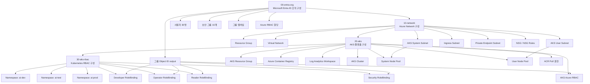
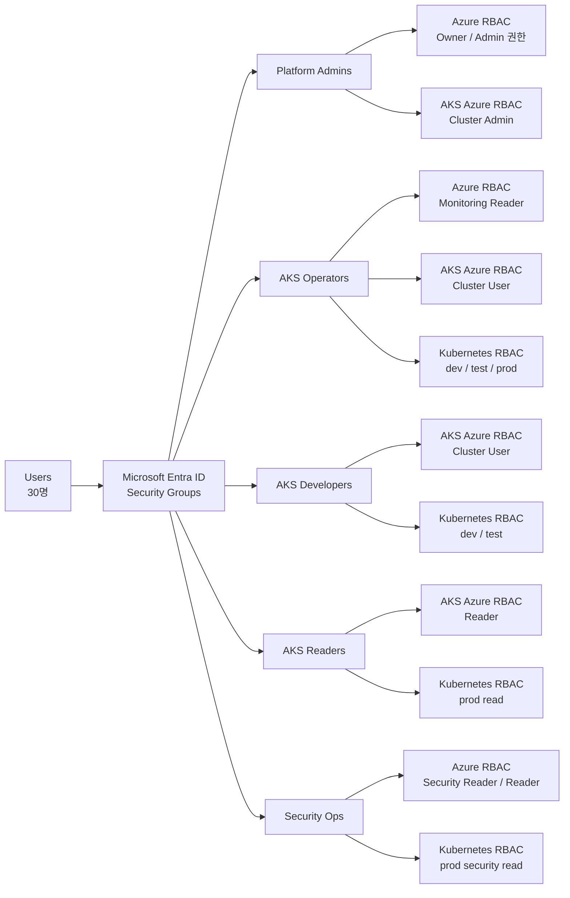
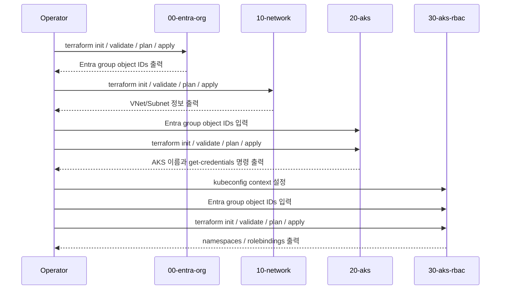
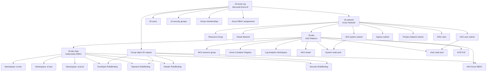

# Azure Entra ID + AKS Small Company Lab

> Korean and English documentation for a Terraform-based Microsoft Entra ID, Azure Network, AKS, and Kubernetes RBAC lab.

This repository is a small-company lab architecture that creates Microsoft Entra ID users and groups, assigns Azure RBAC roles to groups, deploys an AKS-ready network, creates an AKS cluster, and configures namespace-level Kubernetes RBAC.

This project intentionally uses a staged Terraform layout so that each layer can be understood, planned, applied, and troubleshot independently.

## Security Notice

Do not commit real tenant IDs, subscription IDs, Entra group object IDs, kubeconfigs, Terraform state, Terraform plans, or generated passwords.

The following files and directories must stay local:

- `**/sonmap.auto.tfvars`
- `**/terraform.tfstate`
- `**/terraform.tfstate.backup`
- `**/tfplan`
- `**/.terraform/`
- `~/.kube/config`

Terraform state for `00-entra-org` can contain initial user passwords. Treat it as a secret.

Use placeholder values in examples:

```hcl
tenant_id       = "<TENANT_ID>"
subscription_id = "<SUBSCRIPTION_ID>"
```

Never publish values from your real Entra tenant or personal Azure account.

---


# 한국어 문서

## 1. 프로젝트 개요

이 프로젝트는 중소 규모 회사의 Azure 기반 AI/AKS 실습 환경을 Terraform으로 구성하는 예제입니다.

구성 목표는 다음과 같습니다.

- Microsoft Entra ID 사용자 30명 생성
- 권한 부여용 Entra ID 보안 그룹 생성
- 사용자 직접 권한 부여가 아닌 그룹 기반 Azure RBAC 구성
- AKS용 VNet, Subnet, NSG 구성
- AKS, ACR, Log Analytics 생성
- AKS Azure RBAC 연결
- Kubernetes Namespace, Role, RoleBinding 구성

핵심 설계 원칙은 다음입니다.

```text
사용자 -> Entra ID 보안 그룹 -> Azure RBAC / AKS Azure RBAC -> Kubernetes RBAC
```

사용자에게 직접 권한을 부여하지 않고, 보안 그룹에 권한을 부여한 뒤 사용자를 그룹에 배치하는 구조입니다.

## 2. 전체 아키텍처




## 3. 권한 모델

이 프로젝트는 Entra ID 보안 그룹을 중심으로 권한을 나눕니다.



대표 그룹 역할은 다음과 같습니다.

| Group | Purpose |
| --- | --- |
| `SG-AZ-PLATFORM-ADMINS` | 플랫폼 관리자, 실습 환경에서 구독 관리자 역할 |
| `SG-AZ-SECURITY-OPS` | 보안 운영자, 보안/로그/읽기 권한 |
| `SG-AZ-AKS-OPERATORS` | AKS 운영자 |
| `SG-AZ-AKS-DEV-DEVELOPERS` | AKS 개발자 |
| `SG-AZ-AKS-READERS` | AKS 조회자 |
| `SG-AZ-AI-POWER-USERS` | 관리자, 보안, 운영, 개발, 데이터 엔지니어 묶음 |
| `SG-AZ-AI-CASUAL-USERS` | 일반 사용자 |
| `SG-AZ-AI-DATA-ENGINEERS` | 데이터 엔지니어 |
| `SG-AZ-AI-APP-USERS` | 애플리케이션 사용자 |
| `SG-AZ-READERS` | Azure 리소스 조회자 |

운영 환경에서는 `Owner` 권한을 상시 부여하지 말고 PIM Eligible 권한으로 전환하는 것이 좋습니다.

## 4. 디렉터리 구조

```text
terraform-root/
├── 00-entra-org/
│   ├── data/
│   │   ├── users.csv
│   │   ├── groups.csv
│   │   ├── group_memberships.csv
│   │   ├── azure_rbac.csv
│   │   └── aks_rbac.csv
│   ├── users.tf
│   ├── groups.tf
│   ├── memberships.tf
│   ├── azure_rbac.tf
│   ├── outputs.tf
│   └── sonmap.auto.tfvars
│
├── 10-network/
│   ├── data/
│   │   ├── resource_groups.csv
│   │   ├── vnets.csv
│   │   ├── subnets.csv
│   │   ├── nsgs.csv
│   │   └── nsg_rules.csv
│   ├── vnet.tf
│   ├── subnet.tf
│   ├── nsg.tf
│   └── outputs.tf
│
├── 20-aks/
│   ├── data/
│   │   ├── resource_groups.csv
│   │   ├── acr.csv
│   │   ├── monitor.csv
│   │   ├── aks_clusters.csv
│   │   ├── nodepools.csv
│   │   └── aks_azure_rbac.csv
│   ├── aks.tf
│   ├── nodepool.tf
│   ├── acr.tf
│   ├── monitor.tf
│   └── outputs.tf
│
└── 30-aks-rbac/
    ├── data/
    │   ├── namespaces.csv
    │   ├── roles.csv
    │   └── rolebindings.csv
    ├── namespaces.tf
    ├── roles.tf
    ├── rolebindings.tf
    └── kubernetes_provider.tf
```

## 5. 배포 흐름



## 6. 실행 전 준비

필요 도구:

- Terraform `>= 1.6`
- Azure CLI
- kubectl
- Azure 구독 권한
- Entra ID 사용자/그룹 생성 권한
- Azure RBAC role assignment 권한

Azure 로그인:

```bash
az login
az account set --subscription "<SUBSCRIPTION_ID>"
```

## 7. 민감 정보 파일 생성

`sonmap.auto.tfvars`는 Git에 올리지 않습니다. 각 단계에서 로컬에만 생성합니다.

예시:

```hcl
tenant_id       = "<TENANT_ID>"
subscription_id = "<SUBSCRIPTION_ID>"
user_domain     = "<YOUR_TENANT_DOMAIN>.onmicrosoft.com"
```

## 8. 00단계: Entra ID 조직 구성

```bash
cd 00-entra-org
terraform init
terraform validate
terraform plan -out tfplan
terraform apply tfplan
```

Object ID 확인:

```bash
terraform output group_object_ids
terraform output aks_tfvars_object_ids
```

주의:

- 이 단계는 사용자 30명과 보안 그룹을 생성합니다.
- 초기 비밀번호는 Terraform state에 저장될 수 있습니다.
- `terraform.tfstate`는 절대 Git에 올리지 마세요.

## 9. 10단계: Network 구성

```bash
cd ../10-network
terraform init
terraform validate
terraform plan -out tfplan
terraform apply tfplan
```

출력 확인:

```bash
terraform output
terraform output next_step_20_aks_network_reference
terraform output subnet_ids
```

AKS cluster와 AKS node pool이 사용하는 subnet은 AKS와 같은 Azure region에 있어야 합니다.

## 10. 20단계: AKS 구성

먼저 `00-entra-org` output에서 나온 그룹 Object ID를 `20-aks/sonmap.auto.tfvars`에 입력합니다.

예시:

```hcl
tenant_id       = "<TENANT_ID>"
subscription_id = "<SUBSCRIPTION_ID>"

aks_admin_group_object_ids = [
  "<SG-AZ-PLATFORM-ADMINS_OBJECT_ID>"
]

entra_group_object_ids = {
  "SG-AZ-PLATFORM-ADMINS"      = "<SG-AZ-PLATFORM-ADMINS_OBJECT_ID>"
  "SG-AZ-AKS-OPERATORS"       = "<SG-AZ-AKS-OPERATORS_OBJECT_ID>"
  "SG-AZ-AKS-DEV-DEVELOPERS"  = "<SG-AZ-AKS-DEV-DEVELOPERS_OBJECT_ID>"
  "SG-AZ-AKS-READERS"         = "<SG-AZ-AKS-READERS_OBJECT_ID>"
  "SG-AZ-SECURITY-OPS"        = "<SG-AZ-SECURITY-OPS_OBJECT_ID>"
}

enable_aks_azure_rbac_assignments = true
```

배포:

```bash
cd ../20-aks
terraform init
terraform validate
terraform plan -out tfplan
terraform apply tfplan
```

출력 확인:

```bash
terraform output next_step_30_aks_rbac
```

비용 최소화 팁:

- VM SKU는 region별 quota와 AKS 지원 여부를 모두 만족해야 합니다.
- 특정 region에서 `Standard_D*` quota가 0이면 다른 VM family를 사용해야 합니다.
- `az vm list-usage --location <REGION> -o table`로 quota를 확인하세요.

## 11. 30단계: Kubernetes RBAC 구성

AKS credentials:

```bash
az aks get-credentials \
  -g "<AKS_RESOURCE_GROUP>" \
  -n "<AKS_CLUSTER_NAME>" \
  --overwrite-existing \
  --context "<AKS_CONTEXT_NAME>"
```

Azure RBAC 때문에 일반 context가 `Forbidden`이면 실습 환경에서는 admin context를 사용할 수 있습니다.

```bash
az aks get-credentials \
  -g "<AKS_RESOURCE_GROUP>" \
  -n "<AKS_CLUSTER_NAME>" \
  --overwrite-existing \
  --admin \
  --context "<AKS_CONTEXT_NAME>"
```

`30-aks-rbac/sonmap.auto.tfvars` 예시:

```hcl
kube_config_path    = "~/.kube/config"
kube_config_context = "<AKS_CONTEXT_NAME>"

entra_group_object_ids = {
  "SG-AZ-AKS-OPERATORS"       = "<SG-AZ-AKS-OPERATORS_OBJECT_ID>"
  "SG-AZ-AKS-DEV-DEVELOPERS"  = "<SG-AZ-AKS-DEV-DEVELOPERS_OBJECT_ID>"
  "SG-AZ-AKS-READERS"         = "<SG-AZ-AKS-READERS_OBJECT_ID>"
  "SG-AZ-SECURITY-OPS"        = "<SG-AZ-SECURITY-OPS_OBJECT_ID>"
}
```

배포:

```bash
cd ../30-aks-rbac
terraform init
terraform validate
terraform plan -out tfplan
terraform apply tfplan
```

생성되는 namespace:

- `ai-dev`
- `ai-test`
- `ai-prod`

생성되는 RoleBinding:

- `ai-dev/rb-ai-dev-developers`
- `ai-dev/rb-ai-dev-operators`
- `ai-test/rb-ai-test-developers`
- `ai-test/rb-ai-test-operators`
- `ai-prod/rb-ai-prod-operators`
- `ai-prod/rb-ai-prod-readers`
- `ai-prod/rb-ai-prod-security`

## 12. Excel to CSV workflow

통합 Excel 파일을 수정한 뒤 CSV를 다시 생성할 수 있습니다.

```bash
python3 scripts/export_excel_sheets_to_csv.py \
  --xlsx terraform_root_30users_design.xlsx \
  --root .
```

주의:

- Excel에서 CSV를 만들면 UTF-8 BOM이 붙을 수 있습니다.
- Terraform `csvdecode`가 BOM을 컬럼명 일부로 읽으면 `Unsupported attribute` 오류가 발생합니다.

BOM 제거:

```bash
find . -path "*/data/*.csv" -type f -exec perl -i -CSD -pe 's/^\x{FEFF}//' {} \;
```

## 13. Troubleshooting

### `Unsupported attribute`

CSV 헤더에 BOM이 붙은 경우입니다.

```bash
perl -i -CSD -pe 's/^\x{FEFF}//' data/*.csv
terraform validate
```

### `ErrCode_InsufficientVCPUQuota`

Azure region의 VM family quota가 부족한 경우입니다.

```bash
az vm list-usage --location <REGION> -o table
```

해결 방법:

- quota가 있는 VM family로 변경
- node count 또는 autoscaling max count 축소
- 다른 region에 network와 AKS를 새로 구성
- Azure quota increase 요청

### AKS role name not found

Azure built-in role 이름이 잘못된 경우입니다.

역할 목록 확인:

```bash
az role definition list \
  --query "[?contains(roleName, 'Azure Kubernetes Service RBAC')].roleName" \
  -o table
```

예시 역할:

- `Azure Kubernetes Service RBAC Cluster Admin`
- `Azure Kubernetes Service RBAC Admin`
- `Azure Kubernetes Service RBAC Writer`
- `Azure Kubernetes Service RBAC Reader`

### `kubectl get nodes` Forbidden

AKS Azure RBAC 권한이 없는 사용자 context를 사용한 경우입니다.

실습에서는 admin context로 받을 수 있습니다.

```bash
az aks get-credentials \
  -g "<AKS_RESOURCE_GROUP>" \
  -n "<AKS_CLUSTER_NAME>" \
  --overwrite-existing \
  --admin
```

운영에서는 사용자를 적절한 Entra ID 그룹에 넣고 AKS Azure RBAC를 통해 권한을 부여해야 합니다.

## 14. GitHub 업로드 전 점검

업로드 전에 반드시 확인하세요.

```bash
git status --short
```

아래 파일이 staged 되면 안 됩니다.

```text
*.tfstate
*.tfstate.backup
tfplan
.terraform/
sonmap.auto.tfvars
kubeconfig
```

민감 정보 검색 예시:

```bash
grep -RIn \
  -E "tenant_id|subscription_id|client_secret|password|onmicrosoft.com|terraform.tfstate" \
  . \
  --exclude-dir=.terraform \
  --exclude-dir=.git
```

검색 결과에 실제 개인 계정, 실제 tenant ID, 실제 subscription ID, 실제 object ID가 포함된 파일은 공개 저장소에 올리지 마세요.

## 15. 운영 환경 보강 사항

이 프로젝트는 실습용입니다. 운영 환경에서는 다음 항목을 추가 검토하세요.

- Break-glass 계정 2개
- MFA
- Conditional Access
- PIM Eligible 권한
- Access Review
- Remote backend for Terraform state
- Key Vault 또는 외부 secret manager
- Private AKS cluster
- Azure Policy
- Defender for Cloud
- Log retention 정책
- 비용 예산과 alert

---

# English Documentation

## 1. Project Overview

This project is a Terraform-based small-company lab for Microsoft Entra ID, Azure networking, AKS, and Kubernetes RBAC.

It creates:

- 30 Microsoft Entra ID users
- Security groups for access control
- Group-based Azure RBAC assignments
- AKS-ready virtual network, subnets, and NSGs
- AKS, ACR, and Log Analytics
- AKS Azure RBAC assignments
- Kubernetes namespaces, roles, and role bindings

The main design principle is:

```text
Users -> Entra ID security groups -> Azure RBAC / AKS Azure RBAC -> Kubernetes RBAC
```

Do not assign permissions directly to users. Assign permissions to groups and manage access through group membership.

## 2. Architecture



## 3. Deployment Order

```text
00-entra-org  ->  10-network  ->  20-aks  ->  30-aks-rbac
```

Each stage is a separate Terraform root module.

## 4. Stage 00: Entra ID Organization

```bash
cd 00-entra-org
terraform init
terraform validate
terraform plan -out tfplan
terraform apply tfplan
```

Get group object IDs:

```bash
terraform output group_object_ids
terraform output aks_tfvars_object_ids
```

Important:

- This stage creates real Entra ID users and groups.
- Initial passwords may be stored in Terraform state.
- Never commit `terraform.tfstate`.

## 5. Stage 10: Azure Network

```bash
cd ../10-network
terraform init
terraform validate
terraform plan -out tfplan
terraform apply tfplan
```

Check outputs:

```bash
terraform output
```

AKS and the subnet used by AKS node pools must be in the same Azure region.

## 6. Stage 20: AKS

Before applying this stage, put the group object IDs from stage 00 into `20-aks/sonmap.auto.tfvars`.

Example:

```hcl
aks_admin_group_object_ids = [
  "<SG-AZ-PLATFORM-ADMINS_OBJECT_ID>"
]

entra_group_object_ids = {
  "SG-AZ-PLATFORM-ADMINS"      = "<SG-AZ-PLATFORM-ADMINS_OBJECT_ID>"
  "SG-AZ-AKS-OPERATORS"       = "<SG-AZ-AKS-OPERATORS_OBJECT_ID>"
  "SG-AZ-AKS-DEV-DEVELOPERS"  = "<SG-AZ-AKS-DEV-DEVELOPERS_OBJECT_ID>"
  "SG-AZ-AKS-READERS"         = "<SG-AZ-AKS-READERS_OBJECT_ID>"
  "SG-AZ-SECURITY-OPS"        = "<SG-AZ-SECURITY-OPS_OBJECT_ID>"
}
```

Apply:

```bash
cd ../20-aks
terraform init
terraform validate
terraform plan -out tfplan
terraform apply tfplan
```

Check the next step:

```bash
terraform output next_step_30_aks_rbac
```

## 7. Stage 30: Kubernetes RBAC

Get AKS credentials:

```bash
az aks get-credentials \
  -g "<AKS_RESOURCE_GROUP>" \
  -n "<AKS_CLUSTER_NAME>" \
  --overwrite-existing \
  --context "<AKS_CONTEXT_NAME>"
```

If the user context is blocked by AKS Azure RBAC in a lab, use an admin context:

```bash
az aks get-credentials \
  -g "<AKS_RESOURCE_GROUP>" \
  -n "<AKS_CLUSTER_NAME>" \
  --overwrite-existing \
  --admin \
  --context "<AKS_CONTEXT_NAME>"
```

Apply:

```bash
cd ../30-aks-rbac
terraform init
terraform validate
terraform plan -out tfplan
terraform apply tfplan
```

## 8. Cost and Quota Notes

AKS VM SKU selection depends on:

- Azure region
- VM family quota
- AKS-supported SKUs in that region
- Required vCPU count

Check quota:

```bash
az vm list-usage --location <REGION> -o table
```

If deployment fails with `ErrCode_InsufficientVCPUQuota`, use a smaller node count, a different VM family, another region, or request a quota increase.

## 9. CSV and Excel Notes

CSV files are generated from the Excel workbook.

```bash
python3 scripts/export_excel_sheets_to_csv.py \
  --xlsx terraform_root_30users_design.xlsx \
  --root .
```

If Terraform reports `Unsupported attribute`, remove UTF-8 BOM from CSV files.

```bash
find . -path "*/data/*.csv" -type f -exec perl -i -CSD -pe 's/^\x{FEFF}//' {} \;
```

## 10. Do Not Commit Secrets

Before pushing to GitHub, verify:

```bash
git status --short
```

Do not commit:

- Terraform state
- Terraform plan files
- `.terraform` directories
- Real `.auto.tfvars` files
- kubeconfig files
- generated passwords
- real tenant or subscription identifiers

Use `.gitignore` and placeholder examples instead.

